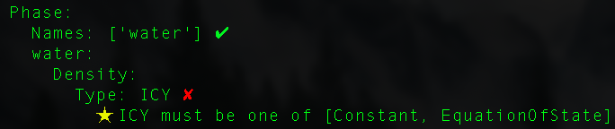
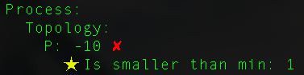
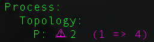

********************************************************************************
Error messages and troubleshooting
********************************************************************************

===================================================
Validation
===================================================

An objective of the Python PFTools is to improve the error messages before and during a ParFlow run. The first step of this is validation.
If you call the ``validate()`` method on your ``Run`` object with incorrect values set to a key, you will get a range of error messages like the following:

You will also get a warning if you set a key multiple times, as shown:

Here, ``Process.Topology.P`` was set three times: first to 1, then to 4, and finally to 2.

===================================================
Running ParFlow
===================================================

When executing ParFlow via the Python script, if the ParFlow run fails, it will simply print out the contents of the *runname.out.txt* file.

=====================================================
Troubleshooting when converting TCL script to Python
=====================================================

Python PFTools has a comparison tool that allows you to sort and compare two *.pfidb* files to determine any discrepancies between two runs.
This is especially useful when comparing an existing TCL script's generated file to its Python-generated equivalent. First, you must sort each of the
*.pfidb* files, using the following command:

.. code-block:: bash

    python3 -m parflow.cli.pfdist_sort -i /path/to/file.pfidb -o /tmp/sorted.pfidb

``/path/to/file.pfidb`` is the path to the existing (input, denoted by the ``-i``) *.pfidb* file, and ``/tmp/sorted.pfidb`` is the file path where you want the sorted output (denoted by the ``-o``) *.pfidb* file to be written.

Once you have the newly sorted files, you can compare them using one of many methods of file comparison, such as ``diff``:

.. code-block:: bash

    diff /path/to/from_tcl_sorted.pfidb /path/to/from_py_sorted.pfidb

You'll likely see some subtle format differences between the TCL- and Python-generated files (decimal printing, etc.). Most of these do not affect the execution of ParFlow.
